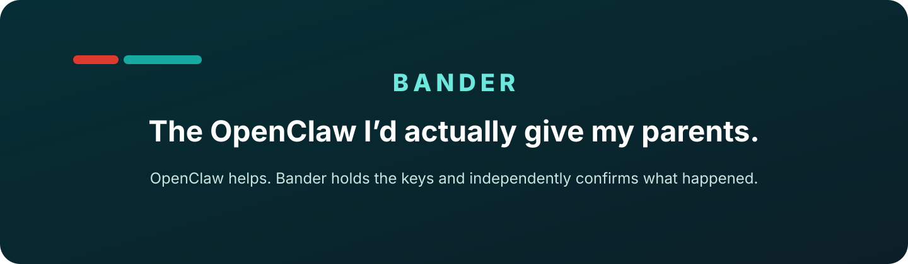
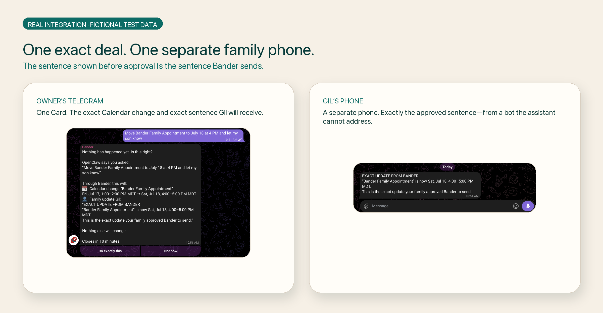
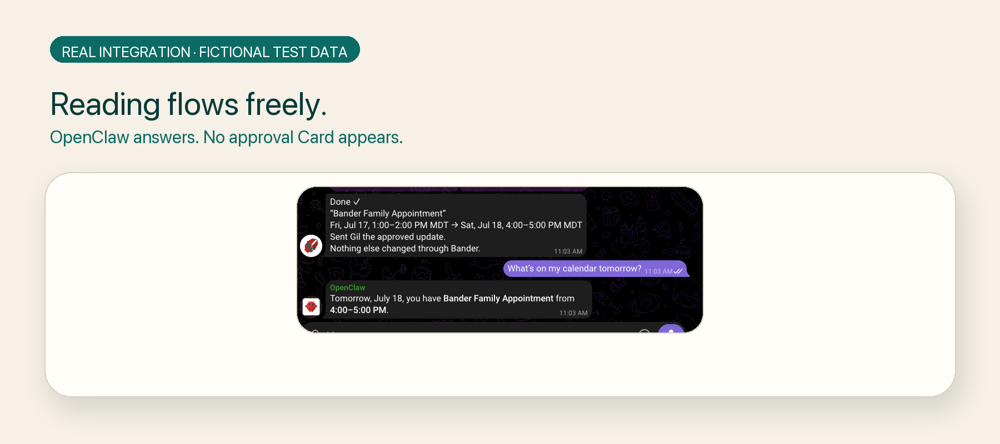
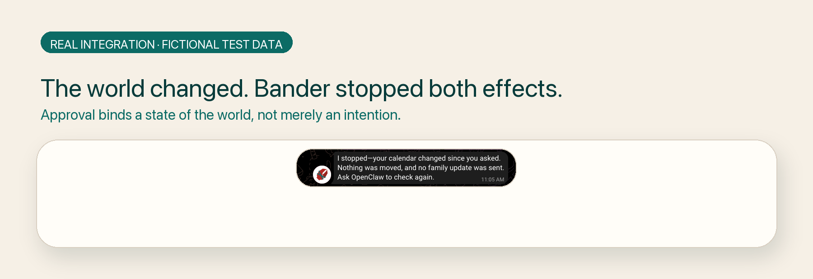
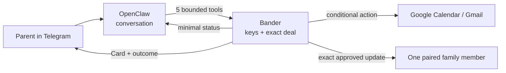

<p align="center">
  
</p>



# Bander

**The OpenClaw I’d actually give my parents.**

Your assistant can read your calendar and mail and talk like a person. Bander holds the keys—calendar changes, email replies, and family messages happen only as exact deals you approve, and Bander reports only what it can prove.

### [▶ Try Bander in your browser — no accounts, nothing real can happen](https://gowtham0992.github.io/bander/)

The browser is a deterministic, seeded product experience. It cannot contact Google, Gmail, Telegram, OpenAI, OpenClaw, or your accounts.

## Judge quickstart

```bash
npm ci && npm run demo
# Open http://127.0.0.1:4310 — 27 deterministic outcomes

npm run verify:demo
# Verifies all 27 outcomes without accounts or credentials
```

The supported Node floor is 22.12.0; CI and the repository-pinned runtime use Node 24. In the clean-clone verifier, both measured warm-cache runs completed in 13 seconds on the development machine. Package and network download speed are the main variables, so this is measured evidence rather than a fixed-time promise. Expected output ends with `27 of 27 demo outcomes passed`. No shared judge account is provided because shared credentials would contradict Bander’s trust model.

## For Build Week judges

**Category:** Apps for Your Life

- [Hosted Pages sandbox](https://gowtham0992.github.io/bander/)
- [Three evaluator paths](#evaluator-paths)
- [Real installation and setup](SETUP.md)

The required `/feedback` Codex Session ID is supplied through Devpost.

## The 30-second story

1. **Mum asks what is coming up tomorrow.** OpenClaw answers conversationally. No Card and no approval toll.
2. **She asks to reply to an email.** Bander shows the recipient and exact email reply before anything is sent.
3. **She approves once.** Bander sends only those stored bytes.
4. **She asks to add the appointment and tell Gil.** One Card shows the Calendar change and the exact sentence Gil will receive.
5. **The Calendar changes first; then Gil’s separate phone receives precisely what she approved.** If the email or Calendar changed first, Bander stops. If an external result cannot be confirmed, Bander says so and does not send again blindly.

## Real product, fictional data

The browser experience uses seeded data and cannot contact real services. The screenshots below come from Bander’s real Telegram, Google Calendar, Gmail, OpenClaw, and GPT‑5.6 integration using fictional test data. The evidence ledger records the corresponding live runs and failure-first verification.



*One Card. The exact Calendar change and the exact sentence Gil will receive. A separate phone receives precisely that sentence—from a bot the assistant cannot address.*

### Reading without an approval toll



*Reading flows freely. Bander speaks when something real is about to change.*

### Approval is tied to the world the parent saw



*Approval binds a state of the world, not merely an intention.*

## Why not just native approvals?

OpenClaw’s approvals are useful, and Bander does not replace them. They gate what a credential-holding process may do. Bander moves the credentials themselves—Calendar, Gmail, and its Telegram identity—outside the reasoning agent.

Every approval binds to rechecked world state, such as a Calendar ETag or the newest message in an email thread. Bander executes the stored bytes and reports only observed results from an identity the model cannot speak through.

When Gmail’s response to a send was lost, Bander reported the result as unconfirmed and provably did not send again. That behavior—not the approval button—is the product.

This boundary applies to the dedicated Bander-protected OpenClaw profile. It does not protect a machine already compromised at the operating-system or user-account level, and it does not restrict the owner’s other agents or applications.

## Two identities, one clear boundary

OpenClaw is the conversational assistant. It can answer bounded schedule and inbox questions and ask Bander to prepare a deal. Bander is the separate guardian identity: it holds the Google and Telegram credentials, shows the exact human approval surface, performs the stored action, and reports the observed outcome. OpenClaw cannot speak through Bander.



## What a parent can do

- Ask what is on the calendar without approving a read.
- Read one matching email without approving a read.
- Add, move, or remove one narrowly eligible Calendar event.
- Approve one exact plain-text reply to a resolved email thread.
- Approve an exact family update to one consented family member.
- Say **Not now** or receive a truthful stop when the world changed.
- See an unconfirmed result described honestly, without a blind repeat.

<details>
<summary><strong>Full implemented boundary and qualifiers</strong></summary>

The real product currently supports ordinary OpenClaw conversation; bounded primary-Calendar reads of at most 31 days and 50 sanitized events; bounded Gmail inbox reads; one timed default Calendar creation with a disclosed 60-minute default or explicit 15-minute-to-12-hour duration; one exact eligible-event reschedule or cancellation under its ETag; one exact plain-text Gmail reply; and one deterministic Telegram family update bound to the single active consented contact.

Writable Calendar events must be on `primary`, timed, non-recurring, `default` type, owner-organized, attendee-free, and exactly resolved. Creation adds no attendees, recurrence, location, description, conferencing, attachments, custom reminders, or reservation. Gmail excludes spam/trash and never adds recipients, reply-all, forwarding, attachments, or arbitrary outbound threads. Bander does not make reservations, purchases, medical decisions, transportation changes, or smart-home changes. Standing autonomy is demonstrated only in the deterministic sandbox.

The real protected OpenClaw profile exposes exactly five tools:

- `bander__list_capabilities`
- `bander__read_schedule`
- `bander__read_inbox`
- `bander__propose_action`
- `bander__get_receipt`

`gpt-5.6-sol` may extract bounded language hints. Deterministic Bander code chooses identities, versions, final intervals, recipients, routing, rendered messages, MIME, execution parameters, authority, and outcomes.

</details>

## How Codex and GPT‑5.6 Sol were used

**Codex was the primary implementation and verification partner.** The build proceeded in bounded slices: observe the load-bearing behavior fail, implement the narrow fix, then deliberately mutate critical guards to prove the regression tests could catch the real defect. Codex accelerated the authority engine, Google and Telegram integrations, browser sandbox, repository-local setup flow, tests, and documentation. The [evidence ledger](BUILD_WITH_CODEX.md) names the properties actually observed red; it does not claim every static test failed first.

**The human chose the product boundary.** Credentials and outcomes remain outside the reasoning agent. Reads are toll-free; consequential effects become exact approved deals. OpenClaw and Bander are visibly separate Telegram speakers. Eligibility stays narrow. Standing authority remains sandbox-only. Bander refuses to fake reservations, smart-home actions, or scam detection. Every public capability claim was reviewed against observed behavior.

**Iteration changed the product.** Live work showed that Gmail rewrote the caller-supplied `Message-ID`; the first compound approval exposed a state-lock deadlock; and an ambiguous Calendar execution was initially about to be described as “nothing changed.” The setup path and public sandbox were repeatedly compared with actual runtime behavior rather than accepted from generated prose.

Bander exists now because GPT-5.6 Sol crossed a threshold: it interprets imperfect, natural parent phrasing reliably enough to act on — our live probe suites show zero false accepts across 40+ adversarial phrasings ([evidence](BUILD_WITH_CODEX.md#checkpoint-23--live-gpt-56-sol-bounded-intent-compiler)). That solved the understanding. It did not solve the trust, which is why the rest of this repository exists. In the product, Sol has bounded roles only: **GPT‑5.6 Sol operates inside those deterministic boundaries.** OpenClaw uses it for conversation and genuine tool selection. Bander uses strict Structured Outputs for bounded Calendar, inbox, reply, and family hints. Sol cannot choose identities, recipient addresses, credentials, authority, execution parameters, or outcome language.

**Codex built and tested the system; GPT‑5.6 Sol operates within its deterministic boundaries.** The `/feedback` Session ID from the primary build task will be supplied directly in Devpost, not committed as a placeholder.

## Evaluator paths

| Path | What it proves | What it does not prove | Cleanup |
| --- | --- | --- | --- |
| **90-second hosted experience** | Seeded product story, shared Card/authority behavior, replay, and truthful uncertainty | Live OpenClaw, Google, Gmail, or Telegram access | Close the tab |
| **Clone + deterministic verification** | Reproducible 27-outcome sandbox and browser/server parity from the lockfile | A live external-service mutation | `Ctrl-C`; optionally remove the clone |
| **Optional real setup** | The bounded real path with the evaluator’s disposable test accounts | Broad OAuth onboarding or modification of an existing OpenClaw | Follow selective recovery in [SETUP.md](SETUP.md) |

## Real services and evidence

- [Architecture decisions](docs/architecture.md)
- [Product source of truth](Bander_Build_Plan.md)
- [Real Calendar boundary](BUILD_WITH_CODEX.md#checkpoint-22--real-google-calendar-risk-spike)
- [Schedule read lane](BUILD_WITH_CODEX.md#july-16-2026--bounded-real-schedule-read-lane)
- [Family pairing and replay-safe delivery](BUILD_WITH_CODEX.md#july-16-2026--replay-safe-family-notification-delivery)
- [Calendar creation and cancellation](BUILD_WITH_CODEX.md#2026-07-16--checkpoint-7b-precondition-pinned-real-calendar-cancellation)
- [Gmail and direct-family coordination](BUILD_WITH_CODEX.md#2026-07-16--checkpoint-8-family-coordination-concierge)
- [Browser product surface](BUILD_WITH_CODEX.md#2026-07-16--combined-checkpoint-9-public-product-surface)
- [Guided setup and recovery](BUILD_WITH_CODEX.md#2026-07-16--combined-checkpoint-10-external-owner-and-evaluator-surface)
- [Judge-facing product surface](BUILD_WITH_CODEX.md#2026-07-17--combined-checkpoint-11-judge-surface-freeze)

The fresh Checkpoint 11 matrix contains 478 runtime functional cases and 26 adversarial cases. Load-bearing safety properties were observed failing before their fixes; the ledger identifies those specific red→green cases rather than claiming that every safety property failed first.

## Guided real setup

The complete adult-child setup, BotFather privacy checks, Google Desktop OAuth steps, remote family invitation, doctor, and recovery paths live in [SETUP.md](SETUP.md).

```bash
npm ci
npm run setup
# Follow the repository-local guide and edit the ignored .env yourself.
npm run doctor
npm run doctor -- --live
npm run real
```

`npm run setup` is a repository-local setup guide and verifier, not an installer. It never reads or modifies `~/.openclaw`; `npm run real` launches repository-pinned OpenClaw 2026.7.1 in an isolated generated home. Setup does not collect or print secrets.

**Supported and empirically verified:** macOS on Apple Silicon; Node 22.12.0 or newer; Node 24 in CI and the pinned child runtime; repository-pinned OpenClaw 2026.7.1; two Telegram bots and one private group; a dedicated Google OAuth Desktop client in External/Testing mode with configured test accounts; and a modern evergreen browser for the sandbox.

**Expected but unverified:** Intel macOS and Linux deterministic sandbox/tests.

**Unsupported:** Windows real mode, Docker, remote/headless production deployment, other OpenClaw versions, additive modification of an existing OpenClaw, and restart-durable production authority. Broad production-grade OAuth onboarding for arbitrary public accounts is unsupported.

## Deterministic browser sandbox

The hosted and local browser experiences use the shared production authority engine, contracts, canonical SHA-256 hashing, and Card renderer against versioned fictional fixtures. They never claim to touch real services.

```bash
npm run demo
npm run verify:demo
npm run build:pages
npm run verify:pages
```

`npm run verify:pages` is the single artifact-security, direct-refresh, and browser/server parity command. Its CSP uses `connect-src 'none'`; the artifact excludes server, OAuth, Telegram, OpenAI, OpenClaw, filesystem, and process-environment modules. Deployment uses the [official Pages Actions workflow](.github/workflows/pages.yml).

## Verification

```bash
npm run check
npm run attack
npm run verify:demo
npm run verify:clean-clone
npm run verify:pages
npm run verify:recovery
npm run verify:standing-recovery
npm run verify:openclaw
npm run verify:read-sol
npm run verify:gmail-sol
npm run verify:create-sol
npm run verify:cancel-sol
npm audit
```

Real-service evidence commands are documented in [SETUP.md](SETUP.md) and the [evidence ledger](BUILD_WITH_CODEX.md); they are not part of the zero-account judge path.

## Security boundary and limitations

> In the Bander-protected OpenClaw profile, the model can converse, read bounded schedule and inbox DTOs, and propose through five bounded Bander tools. It does not receive Google credentials or family routing, cannot approve its own proposal, and cannot author Bander’s Card or outcome. Bander does not protect a host already compromised at the operating-system or user-account level.

- Bander does not provide full Calendar management. Writable actions accept only the narrow event shapes above.
- Schedule and inbox facts intentionally enter the model trajectory so it can answer the parent. Descriptions, Calendar identifiers, ETags, credentials, Cards, callbacks, family routing, and Bander outcomes do not.
- Calendar titles and email text are untrusted data. Sanitizing and quoting them reduces but does not eliminate model prompt-injection risk.
- Gmail may rewrite Message-IDs. Ambiguous sends are reconciled by one opaque Bander header plus exact stored fields and are never resent automatically.
- Telegram has no client idempotency key. A confirmed response means Telegram accepted the message, not that the family member read it. An ambiguous family transport result remains unconfirmed and is not retried.
- Real authority state is process-local and not restart-durable. Telegram installation and delivery state are file-backed; the deterministic sandbox contains the broader recovery demonstrations.
- The loopback-only MCP endpoint is unauthenticated and must not be exposed to a LAN or the public internet.
- The strong route claim applies only inside the dedicated protected profile and effects routed through Bander. Other agents, applications, credentials, and same-host compromise remain outside the claim.

## License and public links

Bander is available under the [MIT License](LICENSE).

- [Browser experience](https://gowtham0992.github.io/bander/)
- [Setup guide](SETUP.md)
- [Architecture](docs/architecture.md)
- [Evidence ledger](BUILD_WITH_CODEX.md)
- [Submission checklist](docs/submission-checklist.md)
