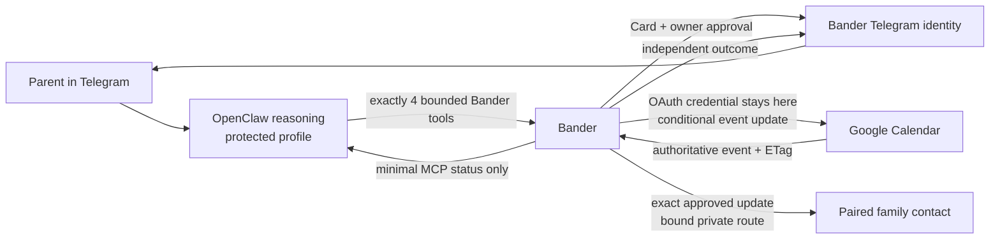

<p align="center">
  
</p>


# Bander

**The OpenClaw I’d actually give my parents.**

OpenClaw helps. Bander holds the keys and independently confirms what happened.

## What Bander is

Bander is a confidence layer for personal AI agents. OpenClaw can understand a natural request and ask Bander to prepare an action. Bander independently resolves the real Calendar action, shows the person the exact event details, and acts only if that person approves that exact deal.

The claim is intentionally narrow: Bander does not decide whether an agent's goal is wise. For effects routed through Bander, it ensures nothing happens beyond the specific deal the person saw and approved.

## A 30-second real journey

1. A parent writes in Telegram: “Move Bander Demo Appointment to July 18 at 4 PM and let my son know.”
2. Conversational OpenClaw uses Bander's bounded proposal tool. Nothing has happened yet.
3. Bander—not OpenClaw—finds one eligible event and the exact paired family contact, then posts one Card with the complete Calendar change and deterministic family update.
4. The bound owner chooses **Do exactly this** or **Not now** on Bander's message.
5. On approval, Bander conditionally updates the same event with its approved Google ETag and only then sends the exact displayed update through its own Telegram bot. If the event changed first, Bander stops and sends neither effect.

## Implemented today

The real product path currently provides:

- ordinary OpenClaw conversation without invoking Bander for greetings or unrelated chat;
- bounded read-only answers about the connected primary Calendar, including timed, all-day, and recurring occurrences, without an approval Card;
- natural-language rescheduling of Google Calendar events on the connected primary calendar;
- natural-language creation of one timed Google Calendar event with a disclosed 60-minute default or an explicit duration from 15 minutes through 12 hours;
- live `gpt-5.6-sol` compilation into a bounded action kind, title hint, optional source date, required destination date/time, and optional create duration;
- exact matching of one timed, non-recurring, owner-organized event with no attendees;
- a human-readable Bander Card with complete source and destination intervals;
- owner-bound approval and decline, exact duration preservation, cross-day moves, and timezone-aware display;
- a stable cryptographically random client event ID committed inside each approved create action, with no blind insert retry after dispatch;
- one immutable compound deal that binds an exact Calendar reschedule and exact paired-family update before approval;
- Calendar-first execution and replay-safe family delivery through Bander's own Telegram identity;
- Google ETag preconditions and a changed-world refusal with no retry against a changed plan; and
- a separate, truthful Bander outcome after Google reports the authoritative state.

## Why Bander lives outside the reasoning agent

An assistant is good at interpreting open-ended language. It should not also hold the downstream credential, describe the permission surface, approve itself, execute, and narrate its own success. Bander separates those jobs.

OpenClaw receives a small exact inventory of four bounded Bander tools. Read-only schedule facts intentionally enter its model trajectory so it can answer the parent. The Google OAuth credential, Calendar identifiers and ETags, deterministic action construction, human approval surface, conditional write, and Bander outcome stay inside Bander.

## How OpenClaw and Bander work together



OpenClaw and Bander are deliberately different Telegram identities: OpenClaw converses; Bander asks for authority and reports outcomes. For schedule questions, only sanitized titles, human-relevant intervals, all-day state, timezone, requested range, and honest empty/truncated state enter OpenClaw's trajectory. Human Cards, callbacks, writable Calendar identifiers and preconditions, refusal details, and Bander outcomes do not.

## Quick start

Choose the path that matches what you want to verify:

| Path | What it uses | Command |
| --- | --- | --- |
| **Real product** | Live conversational OpenClaw, live `gpt-5.6-sol`, real Google Calendar, real Telegram | `npm run real` after the one-time setup below |
| **Hero sandbox** | Deterministic provider, seeded mock Calendar and Messages services, real Telegram | `npm run hero` |
| **Local judge sandbox** | Deterministic browser demo with schedule read, compound family deal, ambiguous outcome, and seeded mock services | `npm run demo` |

The sandbox paths never claim to touch Google.

## Real-product setup

The technical owner should follow [SETUP.md](SETUP.md) for the complete adult-child setup, privacy checks, remote family invitation, doctor, and recovery guide. The concise happy path is:

```bash
npm ci
cp .env.example .env
# Complete Telegram, OpenAI, and Google Desktop OAuth setup in SETUP.md.
npm run pair:real
npm run doctor
npm run doctor -- --live
npm run real
```

The detailed reference below records the current Build Week configuration. `npm run doctor` is read-only and works before `.env` exists; expected setup gaps are actionable `FAIL` rows, not crashes. `npm run doctor -- --live` adds read-only Telegram, primary-Calendar timezone, and exact four-tool probes. It never verifies BotFather privacy by inference—use the empirical procedure in [SETUP.md](SETUP.md).

### 1. Install the supported runtime

- **OS:** macOS. The first Google OAuth flow currently opens the browser with the macOS `open` command.
- **Node.js:** 22.12.0 or newer. The repository pins Node 24.15.0 for the isolated OpenClaw child process.
- **OpenClaw:** the repository installs and tests OpenClaw 2026.7.1 from `devDependencies`; no global OpenClaw install is needed.

```bash
git clone https://github.com/gowtham0992/bander.git
cd bander
npm install
cp .env.example .env
```

### 2. Create two Telegram bots

Use BotFather to create one bot for OpenClaw and a visually distinct Bander bot. Put both bots and the one human owner in one private Telegram group. Neither bot needs to be an administrator.

Configure the verified privacy policy:

- **Bot-to-Bot Communication:** off for both bots;
- **Group Privacy:** off for OpenClaw, so the protected assistant can receive the owner's natural group messages;
- **Group Privacy:** on for Bander, which receives explicit commands and button callbacks rather than ambient group conversation.

Set `OPENCLAW_TELEGRAM_BOT_TOKEN` and `BANDER_TELEGRAM_BOT_TOKEN` only in the ignored local `.env`. Do not reuse a token or place either bot token in repository files.

### 3. Create the OpenAI project key

Create an OpenAI API key with access to the exact model ID `gpt-5.6-sol`, then set `OPENAI_API_KEY` in `.env`. The key is projected into the protected OpenClaw process and Bander's compiler, but not written into the generated OpenClaw configuration or Telegram.

### 4. Configure Google Calendar OAuth

In a dedicated Google Cloud project:

1. Enable the **Google Calendar API**.
2. Configure the OAuth consent screen with **External** audience and **Testing** publishing status.
3. Add the dedicated filming Google account as a test user.
4. Create an OAuth client with application type **Desktop app**.
5. Download the client JSON into the ignored `.bander/` directory, for example `.bander/google-oauth-client.json`.
6. Set `GOOGLE_OAUTH_CLIENT_PATH` to that file and `GOOGLE_OAUTH_TOKEN_PATH` to an ignored path such as `.bander/google-oauth-token.json`.

Bander requests exactly:

```text
https://www.googleapis.com/auth/calendar.events.owned
```

It fixes the Calendar ID to `primary`. The first pairing run opens Google's PKCE/loopback desktop authorization; the resulting token remains in the ignored local token path with private file permissions.

### 5. Set the Calendar timezone

Set `BANDER_RUNTIME_MODE=real` and set `BANDER_CALENDAR_TIME_ZONE` to the connected Calendar's IANA timezone. The filmed and empirically verified configuration is `America/Denver`. Bander reads the selected event's authoritative timezone and preserves its exact duration; broader timezone combinations have not been exhaustively tested.

### 6. Pair the owner and private group once

Run the Bander-owned pairing service:

```bash
npm run pair:real
```

On first Google use, finish the browser OAuth prompt. Bander then writes an expiring private Telegram deep link to `.bander/real/telegram-service/pairing-link.txt`. Open that link in a private chat with the Bander bot, claim it from the intended owner account, and choose the private group where OpenClaw is installed. The first valid claimant is locked; the token expires and is consumed after binding.

When Telegram says **“Bander is ready. Only you can approve what I'm allowed to do.”**, stop the pairing service with `Ctrl-C`.

### 7. Optionally pair one family contact for an approved update

This optional setup connects one revocable family contact for exact, approved appointment updates.
It does not create another approver or expose Calendar access to the contact.

Stop `npm run real`, then run the local operator-only command:

```bash
npm run pair:family -- --name Gil --alias "my son" --alias son
```

Bander stores only a hash of a short-lived link, writes the raw link to an
ignored owner-only file, and sends the same link to the authenticated owner's
private Bander chat. Open it only after switching Telegram to the invited
person's account. That account must not be in the protected OpenClaw group.
The contact explicitly accepts a limited role in a private Bander chat.

The contact cannot approve or decline requests, see the owner's Calendar or
conversations, call OpenClaw, add another contact, or change their label or
aliases. The owner can disconnect the contact from Bander's group confirmation;
the contact can send `/disconnect` privately, and the local operator can run
`npm run revoke:family` while the product is stopped. Either action immediately erases
the routable destination. A revoked contact requires a new operator-created
link. If Telegram cannot verify the contact is outside the protected group,
Bander refuses the pairing or startup check.

Bander can include one deterministic Calendar update to this route in the same
approval Card as an eligible Calendar creation or reschedule. OpenClaw and MCP cannot invoke
delivery directly, choose its destination, or author its text. The Card binds
the exact opaque contact pairing and displays the same deterministically rendered
text that Bander later sends. Revoking or replacing the contact before execution
prevents delivery and never redirects an old approved update.

Telegram has no client idempotency key. Bander persists dispatch before calling
Telegram, records a confirmed response durably, and never retries an ambiguous
transport outcome. A confirmed Telegram response means Telegram accepted the
message; it does not prove the contact read it.

### 8. Stage one eligible fictional event

In the connected primary Calendar, create a fictional event that is:

- timed, not all-day;
- non-recurring;
- organized by the connected owner;
- attendee-free; and
- uniquely identifiable by title in the upcoming 31-day search window when the request omits a source date.

Multiple eligible title matches fail closed and ask for the source date. Zero matches, missing destination details, cancellations, attendee-bearing events, recurring events, and all-day events create no authority.

Creation does not require an existing staged event. It supports one timed default event on `primary`, with no attendees, recurrence, location, description, conferencing, attachments, custom reminders, or reservation. If no duration is stated, the Card discloses the 60-minute default before approval.

### 9. Start the complete real product

```bash
npm run real
```

The command validates the real mode, Google adapter, live model provider, paired Telegram installation, exact four-tool inventory, credential separation, and absence of fixture routes before reporting:

```text
Bander real product is ready.
Telegram → live OpenClaw → Bander → real Google Calendar
```

Talk naturally to OpenClaw in the paired group. Use `Ctrl-C` once to stop the supervised broker and OpenClaw gateway. Running `npm run real` again safely reuses the local OAuth token and owner/group binding. Never run a second gateway against the same OpenClaw bot token at the same time.

## Hero sandbox and judge setup

Hero is a reproducible sandbox—not the canonical parent product and not evidence of a Google mutation. It runs the proven Telegram choreography against a deterministic model provider and seeded mock Calendar/Messages services.

```bash
npm install
npm run hero
```

On first launch, open the expiring pairing link in `.bander/hero/pairing-link.txt`, bind the owner and private group, and rerun the command if prompted. The read-only sandbox view is available at `http://127.0.0.1:4310`.

For a fully local, no-Telegram judge path:

```bash
npm run demo
```

Open `http://127.0.0.1:4310`. Every page is labelled as seeded and not live. The three leading journeys demonstrate a free schedule read with zero authority, one Calendar-plus-family deal whose Card text exactly matches Gil’s simulated phone, and an unknowable Calendar result that sends no family update. Changed-world refusal, replay recovery, and narrow standing limits remain under **More verified behaviors**. `npm run verify:demo` independently reports all nine outcomes.

## Verification and attack suite

The deterministic core is designed to be independently reproducible:

```bash
npm run check
npm run attack
npm run build
npm run doctor
npm run verify:demo
npm run verify:clean-clone
npm run verify:recovery
npm run verify:standing-recovery
npm run verify:openclaw
npm run verify:read-sol
npm run verify:create-sol
npm audit
```

The following empirical verifiers use the locally configured real Telegram bots and require the owner to follow their prompts:

```bash
npm run verify:telegram-privacy
npm run verify:telegram-conflict
npm run verify:telegram-standing
```

The external evidence probes use the dedicated Google/OpenAI credentials in `.env` and can mutate the staged fictional Calendar event:

```bash
npm run verify:google-calendar
npm run verify:gpt-sol
npm run verify:create-live -- --title='Fictional title' --date=2026-07-21
```

The suite covers changed-world preconditions, malformed and broadened model output, ambiguous matching, callback authorization, replay, decline, idempotent HTTP recovery, standing-request recovery in the sandbox, tool isolation, secret separation, and human-only Card/outcome content. See the [evidence ledger](BUILD_WITH_CODEX.md) and [technical architecture](docs/architecture.md).

The current fresh matrix passes **357 runtime functional cases plus 20 adversarial tests** and all nine deterministic demo outcomes. Load-bearing safety properties were observed failing before their fixes; the evidence ledger identifies those specific red→green cases rather than claiming that every static test was observed red.

## Security boundary and limitations

> In the Bander-protected OpenClaw profile, the model can converse, read a bounded schedule DTO, and propose through four bounded Bander tools. It does not receive the connected Google credential, cannot approve its own proposal, and cannot author Bander’s Card or outcome. Bander does not protect a host already compromised at the operating-system/user-account level.

The strong route claim applies only inside the dedicated protected OpenClaw profile and only to effects routed through Bander. It does not restrict a user's other OpenClaw agents, tools, credentials, or applications.

Current limitations are material:

- the real action path only creates one narrow timed default event or reschedules the narrow eligible Google Calendar event shape described above; it does not cancel events or provide full Calendar management;
- schedule reads are limited to the connected primary Calendar, one explicit range of at most 31 days, and at most 50 sanitized events; locations, descriptions, conference links, attachments, attendees, identifiers, and ETags are omitted;
- Calendar titles are untrusted text. Bander strips control and bidirectional-control characters and the OpenClaw prompt treats titles only as quoted data, but this reduces rather than eliminates model prompt-injection risk;
- it can send only the exact deterministic Telegram family update displayed on an approved compound Card; it cannot send arbitrary messages or email, make reservations or purchases, control transportation, perform medical actions, or control locks or smart-home devices;
- the current repository does not provide a production installer for an arbitrary existing OpenClaw configuration;
- real authority state is in memory and is not restart-durable; Telegram installation/callback delivery state is file-backed, while the deterministic sandbox contains the broader recovery demonstrations;
- Bander's local MCP endpoint is unauthenticated and loopback-only; it must not be exposed to a LAN or the public internet; and
- Telegram provides no client idempotency key. A confirmed family delivery is replay-safe, but an ambiguous family transport response is permanently reported as unconfirmed and is not retried automatically. Telegram acceptance proves that Telegram accepted the update, not that the contact read it. Owner-facing Cards, refusals, and outcomes retain their separate at-least-once delivery tradeoff.

## How Codex and GPT-5.6 Sol were used

Codex was the primary builder and verification partner throughout Build Week. It helped turn the product claim into executable invariants, wrote red-first regressions for authority and recovery gaps, integrated the real OpenClaw/Telegram/Google path, ran the attack and privacy suites, and maintained [BUILD_WITH_CODEX.md](BUILD_WITH_CODEX.md) as an evidence ledger of decisions and observed failures.

In the real product, `gpt-5.6-sol` plays three deliberately bounded roles. OpenClaw uses it for ordinary conversation and genuine tool selection. Bander makes separate strict Responses API calls for action intent and read-range intent. The read compiler may select only a start local date, exclusive end local date, and a short clarification. The action compiler may select only the bounded action kind, title/date/time hints, an optional create duration, whether a family update was requested, and the human alias used. It cannot choose a recipient address, message body, Calendar ID, event ID, ETag, credential, timezone, final end time, effects, authority, or execution parameters. Deterministic Bander code resolves an authoritative existing event or generates one stable opaque create identity, resolves the exact active contact pairing, constructs the effects, and fails closed on malformed, missing, ambiguous, or broadened output.

## Roadmap

Future work may add a safe additive installer for existing OpenClaw configurations, restart-durable production authority storage, startup reconciliation, more independently credentialed action adapters, and additional human channels. Those are roadmap items, not current capabilities.

## License

Bander is available under the [MIT License](LICENSE).

For the product source of truth, see [Bander_Build_Plan.md](Bander_Build_Plan.md). Submission preparation is tracked in the [submission checklist](docs/submission-checklist.md).
